<!-- github.com/danganhthuho · the two images in assets/ are hand-made animated SVGs -->

<div align="center">
  
</div>

<p align="center">
  <a href="https://www.linkedin.com/in/thuho05/"></a>
  <a href="mailto:danganhthuho@gmail.com"></a>
</p>

### ~/about

I'm Chrissy, a Computer Engineering student at San José State University (class of 2028), by way of De Anza College. I've interned as a software engineer in Huế, Vietnam and Arlington, Texas, and I compete in programming contests.

```c
const struct engineer chrissy = {
    .builds     = { "realtime multiplayer backends",
                    "e-commerce + inventory systems",
                    "ML forecasting pipelines",
                    "AI-powered iOS & web apps" },
    .coursework = { "Data Structures & Algorithms", "Embedded Systems",
                    "Digital System Design", "Machine Learning Fundamentals",
                    "Object-Oriented Programming", "Software Design & Development" },
};
```

### ~/stack

<b>Languages</b><br>


<b>Frameworks & libraries</b><br>


<b>Cloud & tools</b><br>


<b>Data & ML</b><br>


<sub>Plus OpenGL, pandas, RStudio, LightGBM and Oracle.</sub>

### ~/experience

**Luraco Health and Beauty**, Software Engineer Intern<br>
<sub>Arlington, Texas · June – September 2026</sub>
- Built full-stack e-commerce infrastructure for online sales, order processing, supply-chain management and fulfillment
- Built real-time warehouse dashboards and inventory workflows that **improved fulfillment efficiency by 12%**
- Connected sales, warehouse and fulfillment systems with support ticketing and internal service workflows over APIs

**Gosu Corp**, Software Engineer Intern<br>
<sub>Huế, Vietnam · May – August 2025</sub>
- Developed multiplayer backend services over WebSockets, TCP/UDP and REST, **cutting response latency by 27%**
- Built scalable player, combat, chat and guild services with Redis caching, SQL and message queues
- Hardened production with database tuning, caching, load balancing and monitoring, **reducing backend failures by 20%**

**Brycen Vietnam**, Software Engineer Intern<br>
<sub>Huế, Vietnam · April – September 2024</sub>
- Built enterprise backend services in Java and Spring with REST APIs and SQL for warehouse management
- Developed Angular/React + TypeScript apps on Oracle/MySQL for inventory, barcode processing, sales and fulfillment
- Built a LightGBM pipeline that forecasts pricing trends for a Japanese client, **improving prediction accuracy by 18%**

### ~/projects

<!-- tip: turn each project title into a link to its repo or demo -->
<table>
<tr>
<td width="50%" valign="top">

**👻 GhostCam**

A privacy-focused iOS camera that detects and redacts sensitive content with GPT-4o Vision and VisionKit. It remembers trusted faces with SwiftData and monitors privacy through the Instagram Graph API.

`Swift` `VisionKit` `GPT-4o Vision` `SwiftData`

</td>
<td width="50%" valign="top">

**🖍️ I Don't Want an iPad Baby**

A React/Next.js drawing assistant. It transcribes voice with Deepgram, analyzes sketches with multimodal AI, and gives personalized learning feedback with Groq.

`Next.js` `React` `Deepgram` `Groq`

</td>
</tr>
</table>

### ~/awards

- 🥇 **1st Prize**, ACPC 2026 at UC Davis
- 🥇 **1st Place**, DAHacks 4.0
- 🎈 **Top 30+**, ICPC Pacific Northwest Regional
- 📚 **Dean's List**, De Anza College, 2023 – 2026
- 🎓 **Scholarship recipient**, De Anza College, 2024 – 2026
- 🏛️ **Chair of SRE**, De Anza Student Government, 2026

<br>

<!-- the snake is generated daily by .github/workflows/snake.yml -->
<picture>
  <source media="(prefers-color-scheme: dark)" srcset="https://raw.githubusercontent.com/danganhthuho/danganhthuho/output/snake-dark.svg" />
  <source media="(prefers-color-scheme: light)" srcset="https://raw.githubusercontent.com/danganhthuho/danganhthuho/output/snake-light.svg" />
  
</picture>

<br><br>

<a href="mailto:danganhthuho@gmail.com"></a>
